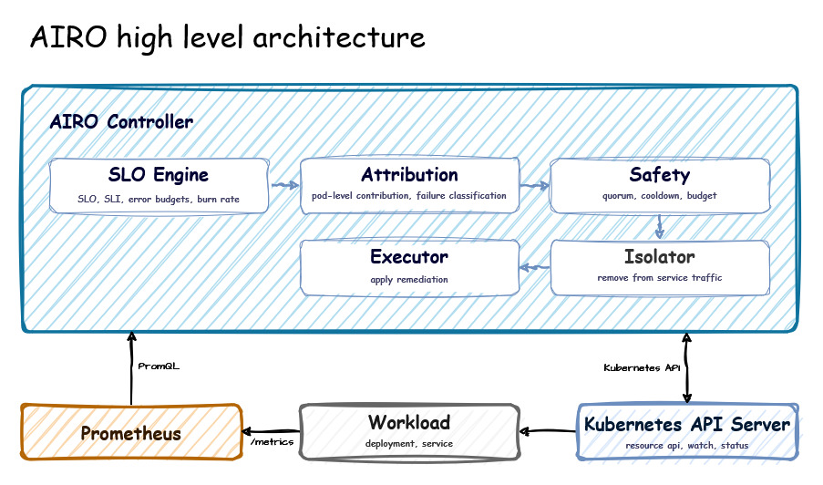

# Architecture

AIRO is a single Kubernetes controller process that observes workload health through Prometheus, evaluates SLO conditions, attributes degradation, checks remediation safety, and performs Kubernetes-native remediation.

The modules inside AIRO are in-process Go components. The Controller orchestrates their execution and uses their results to determine the next action.

### Controller

The Controller is the central reconciliation component and the runtime boundary of AIRO. It is responsible for:
- Watching Kubernetes resources
- Querying Prometheus
- Invoking internal analysis and remediation modules
- Coordinating the remediation lifecycle
- Updating `RemediationPolicy` status
- Recording Kubernetes Events
- Re-evaluating workload health after remediation

The Controller owns the decision flow. Internal modules return analysis or decisions to the Controller rather than invoking one another as independent services.

### SLO Engine

The SLO Engine evaluates whether the observed workload is meeting its configured SLO using Prometheus telemetry. It calculates error-budget consumption and burn rate across short and long time windows to guard against transient spikes. 

For detailed mathematical definitions, PromQL queries, multi-window burn rate calculations, and error-budget formulas, see [sre-math.md](sre-math.md).

### Attribution

Attribution evaluates per-Pod telemetry to determine if a specific Pod is responsible for service degradation or if the failure is systemic across the deployment through the following steps:

1. **Per-Pod Telemetry Collection:** For every active Pod in the workload, AIRO calculates individual Pod SLIs and p99 latencies using Pod-scoped PromQL queries.
2. **Identifying the Culprit:** A Pod is flagged as the primary candidate (culprit) if its individual SLI fails the target SLO while other Pods remain healthy. The attribution confidence score reflects the distance between the outlier Pod's degradation and the remaining fleet average.
3. **Systemic Halt Detection:** If degradation is uniformly distributed across multiple Pods (or all Pods exceed latency/error bounds equally), the issue is flagged as a systemic failure (e.g., downstream database failure, upstream traffic overload, or global deployment bug).
4. **Action:** When systemic failure is detected or attribution confidence is insufficient, AIRO triggers a **Systemic Halt**, blocking Pod deletion to prevent destructive rolling restarts of healthy replicas.

### Safety

The Safety module acts as a policy gatekeeper. Before any remediation action is executed, the proposed Pod target must pass all configured safety conditions.

For the Safety module to produce an **Allow** decision, all of the following conditions must pass:
- **Quorum (`minHealthyReplicas`):** Ensures that removing the degraded Pod will not reduce total healthy operational replicas below this threshold.
- **Cooldown (`cooldownDuration`):** Enforces a mandatory waiting period following the last successful remediation before a new action can occur.
- **Budget (`maxRemediationsPerWindow` & `remediationWindow`):** Caps the maximum allowed Pod remediations within a moving or sliding time window to prevent continuous execution loops.
- **Attribution & Systemic Checks:** Confirms that attribution confidence is sufficient and no systemic failure condition is flagged.

Default numbers (e.g., `minHealthyReplicas: 2`, `cooldownDuration: 5m`, `maxRemediationsPerWindow: 2`, `remediationWindow: 1h`) are arbitrary defaults used in examples and are fully configurable via the `RemediationPolicy` custom resource spec for each specific deployment.

### Isolation

Isolation removes the target Pod from active Service traffic before any destructive action takes place.

The `Isolator` component mutates the Pod's `airo.io/traffic` label from `enabled` to `disabled`. Because Kubernetes Service selectors target `airo.io/traffic: enabled`, changing this label causes the Kubernetes EndpointSlice controller to automatically remove the Pod's IP from the active EndpointSlices. Client traffic immediately stops routing to the degraded Pod while the Pod container process remains running for inspection/deletion. AIRO verifies that the Pod IP has been fully purged from EndpointSlices before proceeding to execution.

### Execution

The `Executor` performs the final Kubernetes action on the isolated Pod by issueing a graceful Pod deletion API call targeting the specific Pod name and immutable Pod `UID`. Deleting the Pod triggers the owning Deployment/ReplicaSet controller to automatically provision a fresh replacement Pod to restore workload capacity.

## Kubernetes Interaction

AIRO interacts with Kubernetes through the API server using `controller-runtime`.

### Read and Watch
- `RemediationPolicy` custom resources 
- `Pods` and `Deployments`
- Workload state required for decision-making

### Write
- Mutate Pod labels (`airo.io/traffic=disabled`) for traffic isolation
- Delete target Pods by name and UID
- Update `RemediationPolicy` status
- Emit Kubernetes Events recording decision outcomes

## Workload Metrics Contract

Workloads are required to expose Prometheus-compatible HTTP metrics (typically at `/metrics`).

- **Latency Telemetry:** Expects `http_request_duration_seconds` histogram metrics with path and status labels.
- **Bucket Matching:** The histogram must contain buckets matching the configured latency threshold (e.g., a 50ms latency threshold requires a `0.05` second histogram bucket).
- **Target Identity:** Metrics must preserve Pod identifiers (`pod` and `pod_uid`) so Prometheus can expose per-Pod time-series data for attribution.