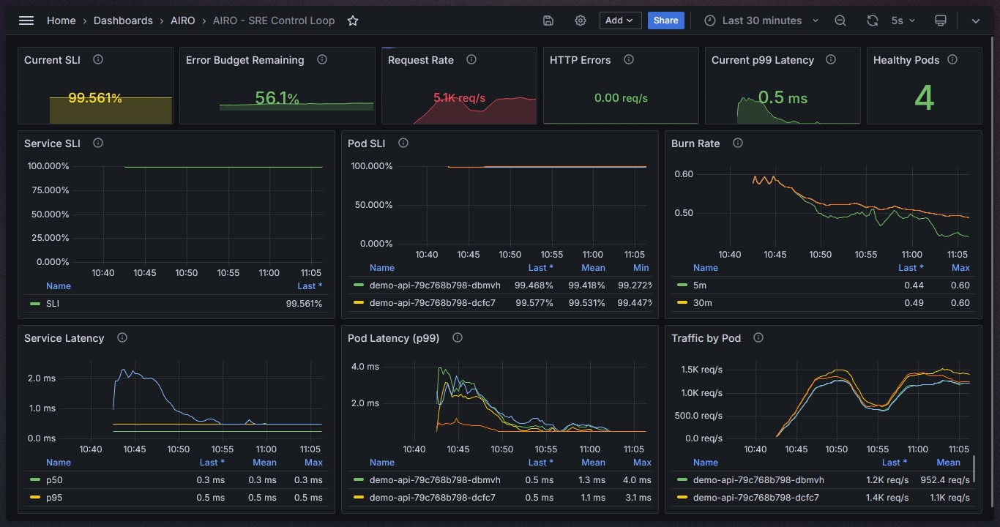

# Development

This guide covers the local development environment for AIRO, including the repository structure, prerequisites, local Kubernetes environment, observability stack, and common development commands.

For contribution workflow and pull request guidelines, see [CONTRIBUTING.md](../CONTRIBUTING.md).

## Prerequisites

The local development environment runs on [KinD](https://kind.sigs.k8s.io/).

Install the following tools:

- Go — use the version specified in `go.mod`
- Docker
- KinD
- kubectl
- Helm
- GNU Make

Verify that the required tools are available before starting development.

## Repository Structure

The repository is organized around the operator implementation, Kubernetes configuration, local development environment, and documentation.

    airo/
    ├── api/                 # Kubernetes API types and CRDs
    ├── cmd/                 # Controller entrypoint
    ├── internal/            # AIRO controller implementation
    ├── config/              # CRD manifests and example resources
    ├── charts/              # AIRO Helm chart
    ├── deploy/              # Local development environment
    │   ├── kind/            # KinD cluster configuration
    │   ├── prometheus/      # Prometheus deployment
    │   └── grafana/         # Grafana deployment
    ├── examples/            # Example workloads
    ├── docs/                # Project documentation
    ├── Makefile             # Development and operational commands
    └── README.md            # Project overview

The AIRO operator itself lives primarily under `api/`, `cmd/`, and `internal/`.

The `deploy/`, `config/` and `examples/` directories support the local development and demonstration environment and are not part of the AIRO operator runtime.

## Local Environment

The complete local environment consists of:

- KinD Kubernetes cluster
- AIRO operator
- Prometheus
- Grafana
- Example `demo-api` workload
- Fortio load generator

The complete environment can be created with:

``` bash
    make dev-up
```

This target creates the KinD cluster, builds the container images, loads them into KinD, deploys Prometheus and Grafana, installs AIRO with Helm, and deploys the example workload.

Check the environment with:

``` bash
    make status
```

When development is finished, remove the local environment with:

``` bash
    make dev-down
```

For a clean cluster recreation:

``` bash
    make cluster-recreate
```

Use `make help` to see all available development commands.

## Local Kubernetes Environment

KinD configuration is located at `deploy/kind/kind-config.yaml`.

This file defines the local cluster topology and host port mappings used by the development environment.

Prometheus and Grafana configurations and manifests are located under `deploy/prometheus/` and `deploy/grafana/`

Prometheus provides the telemetry consumed by AIRO. Grafana is an optional visualization layer used to inspect workload behavior, SLO signals, and remediation activity during local development.

Grafana and Prometheus are not runtime dependencies of the published AIRO Helm chart. They are included here to provide a complete local development and demonstration environment.

Start local access to Prometheus and Grafana with:

``` bash
    make run-monitoring
```

The command establishes the required port-forwards and prints the local URLs.

## Example Workload

The repository includes a small reference workload under `examples/demo-api/`.

The workload is intentionally independent of AIRO. It exposes application metrics and provides deterministic latency injection for demonstrating SLO violations and remediation behavior.

For more information about the demo-api, check [examples/demo-api/README.md](../examples/demo-api/README.md).


## Helm Chart

The AIRO Helm chart is located at `charts/airo/`.

The chart packages the AIRO operator only. Prometheus, Grafana, KinD, the example workload, and the Fortio load generator are part of the local development environment rather than Helm chart dependencies.

Validate the chart with:

``` bash
    make helm-lint
```
Render the chart locally with:


``` bash
    make helm-template
```

The published chart installation procedure is documented in the main [README.md](../README.md).

## Observability

Grafana provides the primary visual interface for inspecting the local demonstration environment.

Used to observe:

- request latency
- SLI and SLO-related telemetry
- burn-rate behavior
- deployment pods' health



Prometheus remains the telemetry source used by AIRO itself. Grafana reads from Prometheus for visualization and does not participate in the remediation control loop.

## Contributing
For further developement guides and contributing to the project, check [CONTRIBUTING.md](CONTRIBUTING.md).
