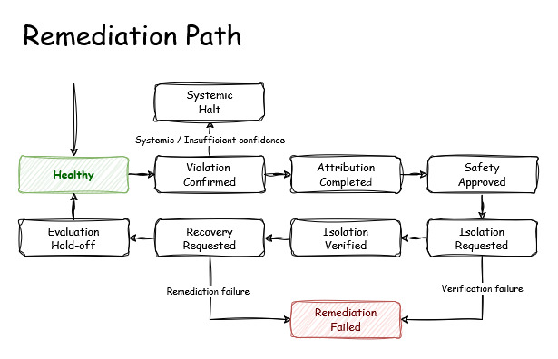

# Remediation

AIRO treats remediation as a gated control loop rather than a direct response to an SLO violation.

The remediation path is:



The phases below are the observed remediation state stored in the `RemediationPolicy` status.

## Remediation Lifecycle

The Controller advances the policy through explicit phases. Each phase represents a completed decision or an operation that is currently being performed.

| Phase | Meaning |
| --- | --- |
| `Healthy` | No remediation is currently required. |
| `ViolationConfirmed` | Configured SLO burn-rate conditions are confirmed. |
| `AttributionCompleted` | Pod-level analysis completed and a remediation target was identified. |
| `SystemicHalt` | Degradation is systemic or cannot be attributed safely; destructive remediation is stopped. |
| `SafetyApproved` | The selected target passed all configured safety gates. |
| `IsolationRequested` | AIRO has requested traffic isolation for the selected Pod. |
| `IsolationVerified` | The target Pod is confirmed absent from active Service endpoints. |
| `RecoveryRequested` | The isolated Pod has been scheduled for destructive recovery. |
| `EvaluationHoldoff` | Remediation completed and evaluation is temporarily held to allow telemetry to settle. |
| `RemediationFailed` | A required remediation operation failed. |

The Controller is responsible for moving between these phases. Attribution, Safety, Isolation, and Execution provide results; they do not form independent controllers.

## Violation Confirmation

The remediation flow starts only after the SLO engine confirms a configured burn-rate violation.

A confirmed violation changes the policy phase to `ViolationConfirmed`.

This phase means that the workload-level signal is strong enough to continue with attribution. It does not identify a Pod and does not authorize deletion.

The burn-rate calculation and configured detection windows are documented in [sre-math.md](sre-math.md).

## Attribution

Attribution answers one question:

> Which Pod, if any, provides sufficient evidence to justify remediation?

AIRO evaluates the active Pods individually using Pod-scoped Prometheus data.

For each Pod, the attribution logic considers:

- Pod SLI
- Pod p99 latency
- comparison with the remaining Pod population
- whether the Pod is an SLO outlier
- whether the degradation is distributed across the workload

When a specific Pod is sufficiently worse than the rest of the workload, it becomes the remediation candidate.

The attribution result advances the policy to `AttributionCompleted`.

The target Pod is retained as the candidate for the subsequent safety evaluation.

### Systemic Failure

Attribution must distinguish an outlier from a fleet-wide failure.

If degradation is distributed across the Pods rather than concentrated in one Pod, AIRO does not select an arbitrary Pod for deletion.

Instead, the policy enters `SystemicHalt`.

`SystemicHalt` is intentionally non-destructive. It records that the workload is degraded but that Pod-level remediation is not justified by the available evidence.

The same halt applies when attribution confidence is insufficient to distinguish a responsible Pod.

The principle is:

- One Pod is materially worse → candidate remediation
- Pods degrade uniformly → Systemic halt

This prevents a shared dependency or deployment-wide failure from causing repeated deletion of otherwise healthy replicas.

## Safety

Attribution identifies a candidate. Safety determines whether removing that candidate is currently allowed.

A successful safety evaluation advances the policy to `SafetyApproved`.

The safety decision is the conjunction of the configured safety gates.

### Healthy Replica Quorum

The candidate can only be removed if the remaining healthy replicas satisfy:
``` go
healthy_replicas_after_remediation >= minHealthyReplicas
```
For example, with:
``` yaml
    minHealthyReplicas: 3
```
a four-replica workload may lose one healthy candidate, while a workload with only three healthy replicas cannot safely lose another.

This is a capacity-preservation constraint, not an attribution decision.

### Cooldown

AIRO prevents repeated remediation immediately after a previous action.

With the example policy:
``` yaml
    cooldownDuration: 5m
```
a new remediation is rejected while the configured five-minute cooldown is active.

This bounds repeated reactions to the same underlying incident.

### Remediation Budget

The policy also limits how many remediations may occur within a configured window.

Example:
``` yaml
    maxRemediationsPerWindow: 2
    remediationWindow: 1h
```
The controller therefore permits at most two remediations within the configured one-hour window.

Once the budget is exhausted, another destructive action is not approved.

### Attribution and Systemic Checks

Safety also requires that the attribution result remains actionable.

The candidate must not be associated with a systemic failure, and the attribution result must satisfy the confidence requirements used by the controller.

If the safety evaluation does not pass, the controller does not proceed to isolation or execution.

The important boundary is:

1. AttributionCompleted
2. SafetyApproved
3. destructive remediation becomes eligible
    

`SafetyApproved` is therefore the final gate before AIRO changes workload traffic.

## Isolation

After safety approval, AIRO isolates the selected Pod before deleting it.

The policy enters `IsolationRequested`.

The `Isolator` changes the target Pod's traffic label `airo.io/traffic=enabled` to `disabled`. 

Therefore the label change causes Kubernetes to remove the target Pod from the Service's active EndpointSlices.

AIRO does not directly modify EndpointSlices.

The sequence is:

1. Pod label changed
2. Service selector no longer matches
3. Kubernetes EndpointSlice controller updates endpoints
4. Pod is removed from active Service traffic

The Pod remains running during this step. This provides a boundary between traffic isolation and destructive recovery.

AIRO then verifies that the target Pod IP has been removed from the relevant EndpointSlices.

Only after successful verification does the policy advance to `IsolationVerified`.

If isolation cannot be established, the destructive operation does not proceed.

## Execution

Once isolation has been verified, AIRO can perform the destructive recovery action.

The policy enters `RecoveryRequested`.

The `Executor` deletes the isolated target Pod through the Kubernetes API.

The deletion targets the specific Pod identity rather than an arbitrary workload replica. The Pod name and immutable Pod UID are used to ensure that the action applies to the intended object.

The resulting Kubernetes flow is:

1. Isolated Pod
2. Pod deletion
3. Deployment / ReplicaSet detects missing replica
4. Replacement Pod created
5. Readiness succeeds
6. Replacement becomes eligible for Service traffic

AIRO does not create the replacement Pod itself. The owning Kubernetes workload controller remains responsible for maintaining the configured replica count.

## Recovery and Evaluation Holdoff

After the recovery action has been requested, AIRO enters `EvaluationHoldoff`.

The current implementation uses a five-minute evaluation holdoff.

This prevents immediate re-evaluation from treating historical Prometheus samples as evidence that the newly replaced Pod is still unhealthy.

The sequence is:

1. RecoveryRequested
2. EvaluationHoldoff
3. Fresh SLO evaluation
4. Healthy or new ViolationConfirmed

The holdoff therefore separates the remediation action from the next independent evaluation cycle.

## Remediation Failure

If a required remediation operation cannot be completed, AIRO enters `RemediationFailed`.

This represents an operational failure rather than a deliberate safety refusal.

Examples include:

- failure to update the Pod label
- failure to verify endpoint removal
- failure to delete the target Pod
- failure during another required Kubernetes API operation

A failed remediation must not be interpreted as successful recovery. The phase provides an explicit terminal state for the failed remediation attempt.